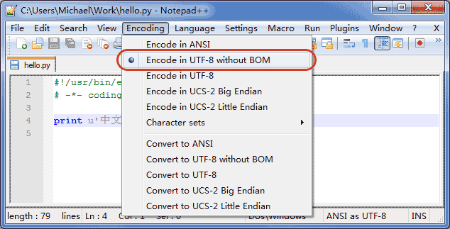

字符编码
我们已经讲过了，字符串也是一种数据类型，但是，字符串比较特殊的是还有一个编码问题。

因为计算机只能处理数字，如果要处理文本，就必须先把文本转换为数字才能处理。最早的计算机在设计时采用8个比特（bit）作为一个字节（byte），所以，一个字节能表示的最大的整数就是255（二进制11111111=十进制255），如果要表示更大的整数，就必须用更多的字节。比如两个字节可以表示的最大整数是65535，4个字节可以表示的最大整数是4294967295。

由于计算机是美国人发明的，因此，最早只有127个字符被编码到计算机里，也就是大小写英文字母、数字和一些符号，这个编码表被称为ASCII编码，比如大写字母A的编码是65，小写字母z的编码是122。

但是要处理中文显然一个字节是不够的，至少需要两个字节，而且还不能和ASCII编码冲突，所以，中国制定了GB2312编码，用来把中文编进去。

你可以想得到的是，全世界有上百种语言，日本把日文编到Shift_JIS里，韩国把韩文编到Euc-kr里，各国有各国的标准，就会不可避免地出现冲突，结果就是，在多语言混合的文本中，显示出来会有乱码。

char-encoding-problem

因此，Unicode应运而生。Unicode把所有语言都统一到一套编码里，这样就不会再有乱码问题了。

Unicode标准也在不断发展，但最常用的是用两个字节表示一个字符（如果要用到非常偏僻的字符，就需要4个字节）。现代操作系统和大多数编程语言都直接支持Unicode。

现在，捋一捋ASCII编码和Unicode编码的区别：ASCII编码是1个字节，而Unicode编码通常是2个字节。

字母A用ASCII编码是十进制的65，二进制的01000001；

字符0用ASCII编码是十进制的48，二进制的00110000，注意字符'0'和整数0是不同的；

汉字中已经超出了ASCII编码的范围，用Unicode编码是十进制的20013，二进制的01001110 00101101。

你可以猜测，如果把ASCII编码的A用Unicode编码，只需要在前面补0就可以，因此，A的Unicode编码是00000000 01000001。

新的问题又出现了：如果统一成Unicode编码，乱码问题从此消失了。但是，如果你写的文本基本上全部是英文的话，用Unicode编码比ASCII编码需要多一倍的存储空间，在存储和传输上就十分不划算。

所以，本着节约的精神，又出现了把Unicode编码转化为“可变长编码”的UTF-8编码。UTF-8编码把一个Unicode字符根据不同的数字大小编码成1-6个字节，常用的英文字母被编码成1个字节，汉字通常是3个字节，只有很生僻的字符才会被编码成4-6个字节。如果你要传输的文本包含大量英文字符，用UTF-8编码就能节省空间：

| 字符|ASCII|Unicode|UTF-8|
|:---:|:---:|:---:|:---:|
| A|01000001|00000000 01000001 |01000001|
| 中	|x|  01001110 00101101|	11100100 10111000 10101101|

从上面的表格还可以发现，UTF-8编码有一个额外的好处，就是ASCII编码实际上可以被看成是UTF-8编码的一部分，所以，大量只支持ASCII编码的历史遗留软件可以在UTF-8编码下继续工作。

搞清楚了ASCII、Unicode和UTF-8的关系，我们就可以总结一下现在计算机系统通用的字符编码工作方式：

在计算机内存中，统一使用Unicode编码，当需要保存到硬盘或者需要传输的时候，就转换为UTF-8编码。

用记事本编辑的时候，从文件读取的UTF-8字符被转换为Unicode字符到内存里，编辑完成后，保存的时候再把Unicode转换为UTF-8保存到文件：

浏览网页的时候，服务器会把动态生成的Unicode内容转换为UTF-8再传输到浏览器：

所以你看到很多网页的源码上会有类似<meta charset="UTF-8" />的信息，表示该网页正是用的UTF-8编码。

第一行注释是为了告诉Linux/OS X系统，这是一个Python可执行程序，Windows系统会忽略这个注释；

第二行注释是为了告诉Python解释器，按照UTF-8编码读取源代码，否则，你在源代码中写的中文输出可能会有乱码。

申明了UTF-8编码并不意味着你的.py文件就是UTF-8编码的，必须并且要确保文本编辑器正在使用UTF-8 without BOM编码：

如果.py文件本身使用UTF-8编码，并且也申明了# -*- coding: utf-8 -*-，打开命令提示符测试就可以正常显示中文：

### 格式化

最后一个常见的问题是如何输出格式化的字符串。我们经常会输出类似'亲爱的xxx你好！你xx月的话费是xx，余额是xx'之类的字符串，而xxx的内容都是根据变量变化的，所以，需要一种简便的格式化字符串的方式。

常见的占位符有：

|占位符|替换内容|
|:---:|:----:|
|%d|整数|
|%f|浮点数|
|%s|字符串|
|%x|十六进制整数|

t = ('a', 'b', ['A', 'B'])

这个tuple定义的时候有3个元素，分别是'a'，'b'和一个list。不是说tuple一旦定义后就不可变了吗？怎么后来又变了？

别急，我们先看看定义的时候tuple包含的3个元素：

当我们把list的元素'A'和'B'修改为'X'和'Y'后，tuple变为：

表面上看，tuple的元素确实变了，但其实变的不是tuple的元素，而是list的元素。tuple一开始指向的list并没有改成别的list，所以，tuple所谓的“不变”是说，tuple的每个元素，指向永远不变。即指向'a'，就不能改成指向'b'，指向一个list，就不能改成指向其他对象，但指向的这个list本身是可变的！

理解了“指向不变”后，要创建一个内容也不变的tuple怎么做？那就必须保证tuple的每一个元素本身也不能变。

